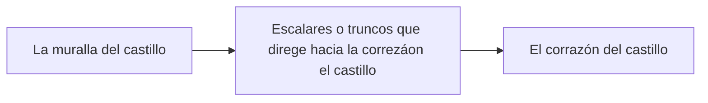
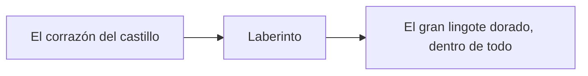

# DEV25-G03-P3
Repositorio creado por el gruopo G03 para el proyecto de salto al castillo

# Punto de partida
Este proyecto está basado con el Unreal Engine 5.6 partiendo de la [plantilla](https://dev.epicgames.com/documentation/en-us/unreal-engine/unreal-engine-templates-reference?application_version=5.6) First Person que ofrece Unreal Engine con la variante Arena Shooter, que recrea un mundo 3D con vista en primera persona y la mecánica del disparo.

-----------------------------------------------------------------------

El punto de partida propuesto para este proyecto, con la documentación e implementación (código y recursos audiovisuales) necesaria, se encuentra en este repositorio de GitHub: [Castle - Base](https://github.com/narratech/castle-base)

# Asalto al Castillo
Este proyecto consiste en desarrollar el prototipo ejecutable de un videojuego de plataformas 3D para jugador con mecánicas inspiradas en una TV show de El Castillo de Takeshi([Fūun! Takeshi Jō]( https://narratech.com/es/desarrollo-de-videojuegos-25-26/)). Cual, tiene su Mecánica como siguiente.

Mecánica:
* En cada partida participaban entre 86 y 146 concursantes que eran guiados por el general Tani por los terrenos del castillo de Takeshi a través de un camino por el que se encontrarán una serie de pruebas físicas que sirven como obstáculos en el que, en cada una de ellas, cierto número de concursantes eran eliminados si no conseguían superarlas. Los concursantes que lograban superarlas y consiguieran llegar a las puertas del castillo, tenían que jugar una última prueba final para intentar ganar el premio final del programa. Estas pruebas aparecían secuencialmente en el programa de televisión, sin embargo los concursantes eran divididos en grupos y no eran obligados a pasar por todas las pruebas.

* Los concursantes siempre empezaban el programa a las afueras de los terrenos en el cual inician su ataque saltando todos a la vez los muros y superando a los esbirros que guardan las afueras. Una vez dentro del camino hacia el castillo, los concursantes se encontraban con 8 zonas, cada una con una prueba que, superarlas, les permitía superarla y avanzar. Estas pruebas eran, en su totalidad, de carácter físico y en muchas de estas se encontraban los esbirros que intentaban evitar que los concursantes lograran superar estas pruebas.

* Una vez los concursantes llegaran a las puertas del castillo, estos tendrían que enfrentarse en una prueba final en persona al mismísimo Takeshi Kitano y a todo su ejército para tomar el castillo. Durante los primeros programas, la prueba final consistía en un asalto al castillo con pistolas de agua. En entregas posteriores, añadieron coches con galletitas de papel y, finalmente, láseres y objetivos sensibles a la luz. Si los concursantes lograban vencer a Takeshi y a sus esbirros en esta prueba final, el castillo se daba por tomado y el juego ganado.

Y en nuestro proyecto la escena (el castillo) se desarrolla en 5 características:
* A. El mundo virtual o sea la escena total se consiste en 3 zonas que a priori se pueden superar fácilmente con el movimiento lateral y el salto del avatar que controla el jugador mediante teclado o -idealmente- mando de juego.
* B. El jugador, ataviado con un sombrero ridículo, debe interactuar con ciertos objetos para eliminar obstáculos del escenario, y hacer así posible la victoria. Concretamente hay llaves de colores que permiten abrir puertas del mismo color y pastillas energéticas que otorgan la capacidad de dar super saltos a nuestro avatar. Se gasta una llave cada vez que la usamos para abrir una puerta, y cada pastilla sólo otorga el super salto durante una pequeña cantidad de tiempo.
* C. La primera zona del juego es un exterior con agua y consiste en cruzar el foso del castillo dando saltos sobre gruesos troncos que flotan sobre el agua, moviéndose lentamente bajo nuestros pies. Si el avatar cae al agua, muere pero reaparece al principio.
* D. La segunda zona consiste en escalar la muralla del castillo aprovechando sus salientes, siendo necesario el uso de pastillas para saltar entre ciertas plataformas. Aunque prime la verticalidad, conviene dividir la escalada en partes, de modo que si el avatar cae, sólo tiene que repetir la escalada de la última parte. Algún saliente estará dañado y se romperá si el avatar lo pisa.
* E. La tercera y última zona es un interior y consiste en atravesar las estancias interiores hasta el corazón del castillo, con varias puertas y algunas trampas. No hay “enemigos” como tales, sólo objetos con movimiento que resultan molestos e incluso mortales para el jugador, y las llaves de las puertas mencionadas anteriormente. Si el avatar muere, será necesario repetir la zona. Finalmente al coger el gran lingote dorado en el interior del castillo, la partida termina.

# Instalación y uso

Los ficheros más importantes del proyecto están disponible en este repositorio, aunque puede que algunos binarios potencialmente grandes estén en el almacén GitHub LFS y se requiera tener activa la extensión Git LFS. El resto de los ficheros, generalmente de contenido más pesado o creado por terceros y sin intención de ser modificado en este proyecto, tendrá que descargarse de carpetas compartidas en [Google Drive](https://drive.google.com/drive/folders/1TfoB5S3yQw49-onoFfn0q79PTfk2RoSE) con ficheros ZIP, para después descomprirlos directamente en la carpeta Content.

Para este proyecto hace falta descargar los ficheros ZIP:

- Characters
- LevelPrototyping
- ThirdPerson
- Variant_Platforming

Y luego extraerlos dentro del archivo **Content**
 
# Preproducción

El diseño tiene estas secciones:

- [Estetica](#Estetica)
    - [Grafico](#Grafico)
    - [Sonido](#Sonido)
- [Dinamica](#Dinamica)
    - [Objetivo](#Objetivo)
    - [Castigo](#Castigo)
- [Mecanica](#Mecanica)
- [Contenido](#Contenido)
    - [Zona A](#Zona-A)
    - [Zona B](#Zona-B)
    - [Zona C](#Zona-C)

# Estetica

El entorno virtual se basa en la plantilla Third Person que ofrece Unreal Engine, que recrea un mundo 3D con vista en tercera persona, a través de una cámara que sigue al avatar; además se incluye el contenido del paquete Starter Content. 

## Grafico

El juego usa solamente el contenido de la plantilla proporcinada por el profesor.

## Sonido

Debido a la falta de tiempo, hemos decidido a no implenmentar sonido en este poyecto.

# Dinamica

La dinamica del juego consiste en pasar todos las zonas hasta llegar al final, no hay limite de tiempo y la muerte no supone la final del juego.

## Objetivo

El objetivo del juego es pasar por todas las pruebas hasta llegar a la corazón del castillo.

## Castigo

El jugador puede morirse en el caso de ser golpeado por barriles o balas de cañon, o caido en la agua. Cuando esto pase, volverá al inicio del nivel o al checkpoint depende de la zona que está el jugador.
Posible mejora (a evaluar)
Suponiendo parametro de vida, si el avatar muere supondria "game over" y deberia reiniciar desde el principio.

# Contenido

A continuación se muestra los componentes del juego.

## Avatar(caracter controlado por el jugador)

El clásico maniquí de Unreal Engine que se puede mover y saltar es el avatar que controla el jugador.

## Pastillas energéticas

Son unos objetos de forma pastilla, cual dará una habilidad de super salto, y se desaparece una vez sido tomada.

## El gran lingote dorado

Es el objeto con cual se gana el jugador.

# Contenido

A continuación se muestra las escenas del juego.

## Zona A

La primera zona del juego es un exterior con agua y consiste en cruzar el foso del castillo dando saltos sobre gruesos troncos que flotan sobre el agua, moviéndose lentamente bajo nuestros pies. Si el avatar cae al agua, muere pero reaparece al principio

## Zona B

La segunda zona consiste en escalar la muralla del castillo aprovechando sus salientes, siendo necesario el uso de pastillas para saltar entre ciertas plataformas. Aunque prime la verticalidad, conviene dividir la escalada en partes, de modo que si el avatar cae, sólo tiene que repetir la escalada de la última parte. Algún saliente estará dañado y se romperá si el avatar lo pisa.

## Zona C

La tercera y última zona es un interior y consiste en atravesar las estancias interiores hasta el corazón del castillo, con varias puertas y algunas trampas. No hay “enemigos” como tales, sólo objetos con movimiento que resultan molestos e incluso mortales para el jugador, y las llaves de las puertas mencionadas anteriormente. Si el avatar muere, será necesario repetir la zona. Finalmente al coger el gran lingote dorado en el interior del castillo, la partida termina.

# Referencia

[Fūun! Takeshi Jō]( https://narratech.com/es/desarrollo-de-videojuegos-25-26/)

[Castle - Base](https://github.com/narratech/castle-base)

# Video demo

Puede verse en el siguiente enlace de youtube:
https://youtu.be/oHOIWi1XPm0

Puede descargarse en el siguiente enlace:
https://drive.google.com/drive/folders/14ALIV9pRV7xGzeA53S0Z2yKjn5nXuOZI?usp=sharing

