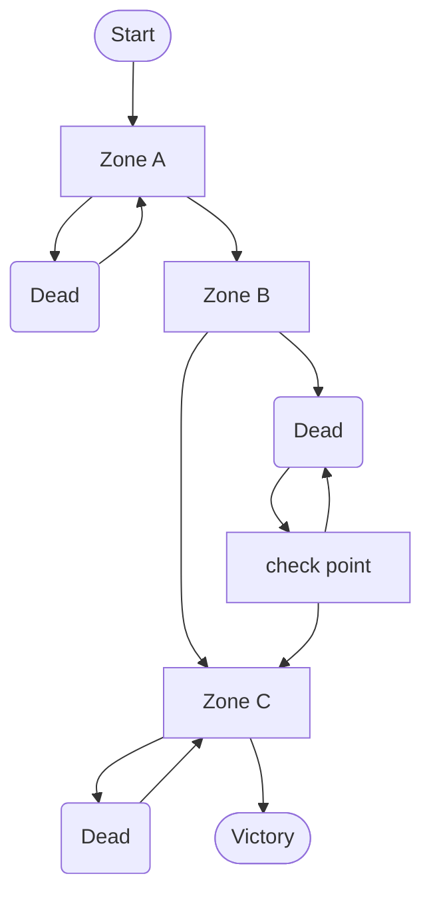
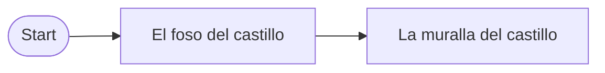
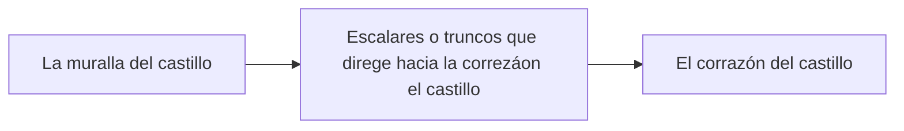
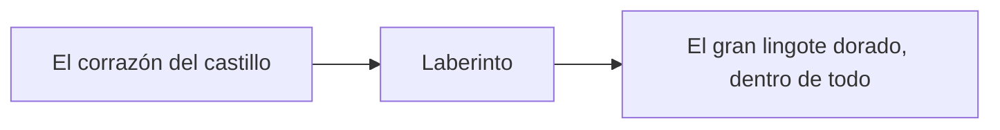

# DEV25-G03-P3
Repositorio creado por el gruopo G03 para el proyecto de pringa veletas

# Punto de partida
El punto de partida es la [plantilla](https://dev.epicgames.com/documentation/en-us/unreal-engine/unreal-engine-templates-reference?application_version=5.6) First Person que ofrece Unreal Engine con la variante Arena Shooter, que recrea un mundo 3D con vista en primera persona, la mecánica del disparo y cambio de arma, y dos personajes inteligentes enemigos. Además se podrá usar contenido del paquete Starter Content, la biblioteca de Quixel [Megascans](https://quixel.com/megascans) y otros recursos gratuitos de [Fab](https://www.fab.com/) como [Modular SciFi Season 1 Starter Bundle](https://www.fab.com/listings/86913335-3c75-42bf-8404-54fe9d9d7396) y [Modular Scifi Season 2 Starter Bundle](https://www.fab.com/listings/cb3c4494-4060-4a80-b079-e46936cb8dd0).

# Pringa Veletas
Este proyecto consiste en desarrollar el prototipo ejecutable de un videojuego de disparos 3D para un sólo jugador que consiste en «pringar» (disparar pintura pringosa) «veletas» (objetivos con cierto movimiento de rotación), manteniendo interacciones tanto competitivas como colaborativas con otros personajes del equipo propio o el equipo rival que también se mueven y disparan como nosotros. 

Las características principales del prototipo son:

<ol type="A">
  <li>
    Hay un mundo virtual consistente en un nivel principal que representa una «arena de combate» con distintos obstáculos y localizaciones. Cada vez que empieza el juego cuatro participantes, dos por cada equipo (equipo rojo y equipo azul), aparecen aleatoriamente en distintos puntos de la arena, así como una serie de 9 objetivos (veletas) que también pueden aparecer en distintas localizaciones y otros recursos como armas, recargas de munición y «duchas». Hay un menú al inicio y otro al final de la partida.
     
  </li>
  <li>
    Nuestro protagonista interactúa con distintos objetos, como armas, recargas de munición, duchas y veletas. Hay tres tipos de arma: pistola, rifle y lanzagranadas… siendo cada una más poderosa que la anterior en cuanto a la capacidad de «pringar» (dañar) veletas y otros jugadores, pero también más lenta y de munición más escasa y valiosa. Sobre la pantalla se mostrará un resumen del inventario del protagonista y cuando se selecciona un arma también se mostrará la munición restante.
     
  </li>
  <li>
   Las veletas, al igual que los demás personajes, muestran una barra encima de ellos que indica cómo de pringados están. Según la veleta se va pringando se mueve a menor velocidad y cuando está muy pringada se para totalmente, cambiando su color al del equipo del último jugador que la disparó y contando como 1 punto para dicho equipo. Cuando un equipo ha parado 5 veletas se declara vencedor de la roda y el nivel con todo su contenido vuelve a reiniciarse. En la pantalla también hay un cronómetro que nos indica cuanto queda de los 5 minutos que dura el partido completo, más las rondas ganadas y las veletas paradas en esta ronda por cada equipo. El jugador que controlamos, como decíamos, puede quedarse incapacitado para disparar si está muy pringado, aunque los jugadores tienen mucha más resistencia al pringue que las veletas.
     
  </li>
  <li>
   Los enemigos buscan los objetivos más interesantes por el nivel, generalmente veletas que tienen cerca pero a veces también nos atacan a nosotros o al otro jugador de nuestro equipo. Con su comportamiento inteligente son capaces de detectar (mediante percepción visual o sonora, si hay algún otro jugador cerca), saben el nivel de pringue de cada objetivo y pueden perseguir, huir y hasta disparar desde cierta distancia a las veletas o los jugadores hasta pringarlos del todo.
     
  </li>
  <li>
   El juego es fácil de superar (solemos ganar) si sabemos equilibrar el disparar veletas con lanzar alguna granada o algo así de contundente a enemigos que estén a punto de llevarse nuestra puntuación. Sin embargo, se vuelve difícil (solemos perder) si jugamos de manera imprudente, sin mucho criterio o si no me coordino bien con mi compañero.
  </li>
</ol>

# Instalación y uso

Los ficheros más importantes del proyecto están disponible en este repositorio, aunque puede que algunos binarios potencialmente grandes estén en el almacén GitHub LFS y se requiera tener activa la extensión Git LFS. El resto de los ficheros, generalmente de contenido más pesado o creado por terceros y sin intención de ser modificado en este proyecto, tendrá que descargarse de carpetas compartidas en [Google Drive](https://drive.google.com/drive/folders/1TfoB5S3yQw49-onoFfn0q79PTfk2RoSE) con ficheros ZIP, para después descomprirlos directamente en la carpeta Content.

Para este proyecto hace falta descargar los ficheros ZIP:

- Characters
- LevelPrototyping
- ThirdPerson
- Variant_Platforming

Y luego extraerlos dentro del archivo **Content**
 
# Preproducción

El diseño tiene estas secciones:

- [Estetica](#Estetica)
    - [Grafico](#Grafico)
    - [Sonido](#Sonido)
- [Dinamica](#Dinamica)
    - [Objetivo](#Objetivo)
    - [Castigo](#Castigo)
- [Mecanica](#Mecanica)
- [Contenido](#Contenido)
    - [Zona A](#Zona-A)
    - [Zona B](#Zona-B)
    - [Zona C](#Zona-C)

# Estetica

El entorno virtual se basa en la plantilla First Person que ofrece Unreal Engine con la variante Arena Shooter, que recrea un mundo 3D con vista en primera persona; además se incluye el contenido del paquete Starter Content. 

## Grafico

El juego usa solamente el contenido de la plantilla proporcinada por el profesor.

## Sonido

Debido a la falta de tiempo, hemos decidido a no implenmentar sonido en este poyecto.

# Dinamica

La dinamica del juego consiste en pasar todos las zonas hasta llegar al final, no hay limite de tiempo y la muerte no supone la final del juego.

## Objetivo

El objetivo del juego es pasar por todas las pruebas hasta llegar a la corazón del castillo.

## Castigo

El jugador puede morirse en el caso de ser golpeado por barriles o balas de cañon, o caido en la agua. Cuando esto pase, volverá al inicio del nivel o al checkpoint depende de la zona que está el jugador.
Posible mejora (a evaluar)
Suponiendo parametro de vida, si el avatar muere supondria "game over" y deberia reiniciar desde el principio.

# Contenido

A continuación se muestra los componentes del juego.

## Avatar(caracter controlado por el jugador)

El clásico maniquí de Unreal Engine que se puede mover y saltar es el avatar que controla el jugador.

## Pastillas energéticas

Son unos objetos de forma pastilla, cual dará una habilidad de super salto, y se desaparece una vez sido tomada.

## El gran lingote dorado

Es el objeto con cual se gana el jugador.

# Contenido

A continuación se muestra las escenas del juego.

## Zona A

La primera zona del juego es un exterior con agua y consiste en cruzar el foso del castillo dando saltos sobre gruesos troncos que flotan sobre el agua, moviéndose lentamente bajo nuestros pies. Si el avatar cae al agua, muere pero reaparece al principio

## Zona B

La segunda zona consiste en escalar la muralla del castillo aprovechando sus salientes, siendo necesario el uso de pastillas para saltar entre ciertas plataformas. Aunque prime la verticalidad, conviene dividir la escalada en partes, de modo que si el avatar cae, sólo tiene que repetir la escalada de la última parte. Algún saliente estará dañado y se romperá si el avatar lo pisa.

## Zona C

La tercera y última zona es un interior y consiste en atravesar las estancias interiores hasta el corazón del castillo, con varias puertas y algunas trampas. No hay “enemigos” como tales, sólo objetos con movimiento que resultan molestos e incluso mortales para el jugador, y las llaves de las puertas mencionadas anteriormente. Si el avatar muere, será necesario repetir la zona. Finalmente al coger el gran lingote dorado en el interior del castillo, la partida termina.

# Referencia

[Fūun! Takeshi Jō]( https://narratech.com/es/desarrollo-de-videojuegos-25-26/)

[Castle - Base](https://github.com/narratech/castle-base)

# Video demo

Puede verse en el siguiente enlace de youtube:
https://youtu.be/oHOIWi1XPm0

Puede descargarse en el siguiente enlace:
https://drive.google.com/drive/folders/14ALIV9pRV7xGzeA53S0Z2yKjn5nXuOZI?usp=sharing

